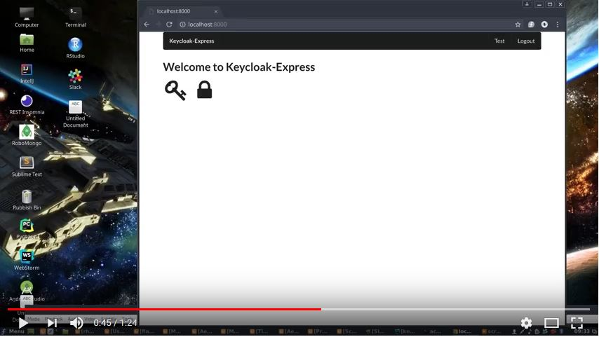

# Keycloak-Express

## About
This is a Node js Express app that uses Keycloak to protect the /test route, 
Login and user setup are controlled by keycloak. The default route / is unprotected. 
The /logout route kills the keycloak session. See the following [blog](https://codeburst.io/keycloak-and-express-7c71693d507a)
for steps to setup the Keycloak server

## Demo Video

### Installation

clone the repo and run **npm install**

### Dependancies 
- Keycloak
- Node
- express
- npm 

### Requirements 
Need to have a Keycloak server up and running

Download Keycloak at 

http://www.keycloak.org/downloads.html

Setup Keycloak as outline at 

www.keycloak.org/docs/latest/getting_started/index.html

Setup a Realm
http://www.keycloak.org/docs/latest/getting_started/index.html#creating-a-realm-and-user

Setup a Open ID Connect Client
http://www.keycloak.org/docs/latest/server_admin/index.html#_clients

To use the Node.js adapter, first you must create a client for your application in the Keycloak Administration Console. The adapter supports public, confidential, and bearer-only access type. Which one to choose depends on the use-case scenario.

Once the client is created click the Installation tab, select Keycloak OIDC JSON for Format Option, and then click Download. The downloaded keycloak.json file should be at the root folder of your project.
See 
http://www.keycloak.org/docs/latest/securing_apps/index.html#_nodejs_adapter# keycloak-demo
